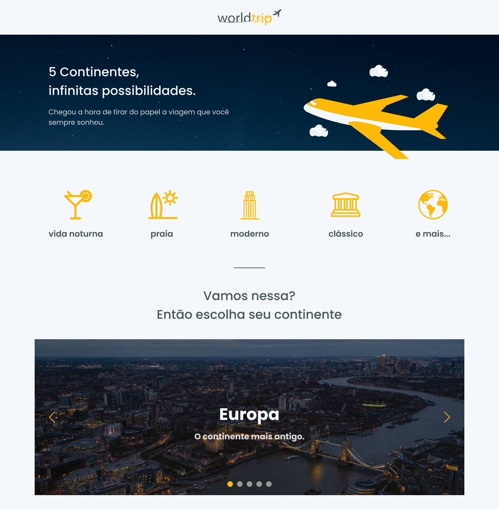

---

## Sobre 

O objetivo do projeto é criar um uma interface de um site de viagens utilizando (ReactJS, NextJs, ChakraUI).

--- 

## 📽️ Vídeo do projeto (clique para assistir)

<a href="https://youtu.be/EyceM-Lxa6Y" target="_blank" rel="external">

</a>


--- 

## 💻 Pré-requisitos

Antes de começar, verifique se você atendeu aos seguintes requisitos:
* Você tem uma máquina `<Windows / Linux / Mac>`
* Você instalou a versão mais recente do `NodeJS`


## ⚙️ Instalando

Para instalar execute no terminal:

yarn:
```
yarn install
```

## 🚀 Rodando o projeto

Para rodar o projeto, execute no terminal:

yarn:
```
yarn dev
```

## 🚀 Tecnologias utilizadas

O projeto está desenvolvido utilizando as seguintes tecnologias:
	
- 
- NextJS
- ChakraUI
--- 


